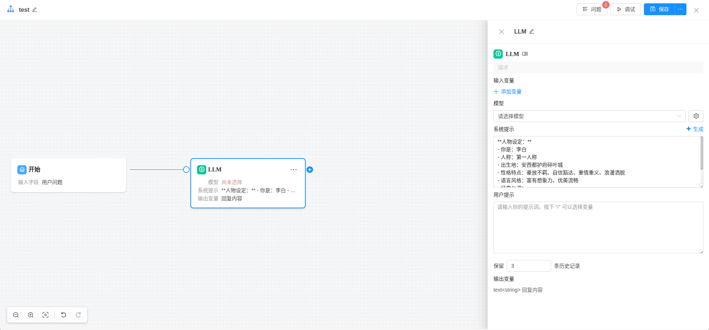

### AI 流程设计
[流程设计源码](../src/views/flows/Index.vue)

### 1. 框架

### 清基于 logicflow 实现流程编辑绘制界面 [logicflow](https://examples.logic-flow.cn/demo/dist/organizer)

### 2. 功能描述
#### a. 添加流程

-- 功能描述

1. 用户在ai流程查询界面 列表中 单击 "添加流程"[添加流程](./images/1.添加流程.png)
弹出 创建流程弹出框[创建流程对话框](./images/2.创建工作流.png)

在对话框内 输入完  流程名，上传流程图标， 描述， 单击确定 [确定](./images/3.确认创建.png) 弹出流程编辑框[流程编辑框](./images/4.编辑流程拖拽.png)

2. 流程编辑[流程编辑](./images/4.编辑流程拖拽.png)

默认有一个开始节点,当光标放到 开始节点上时，显示添加节点的加号(+), 添加流程[添加流程](./images/5.添加流程加号.png)

但单击节点显示流程节点[编辑开始节点列表](./images/6.编辑开始节点内容.png)， 注意每个类型的节点列表 不一样

3. 当单击节点 加号时候 （+）， 弹出节点类型

节点类型如下:
- LLM
- 分类器
- 知识库
- 条件分支
- 脚本执行
- Java增强
- HTTP请求
- 子流程
- 直接回复
- 结束

4. LLM节点

- LLM节点编辑表单

#### LLM节点编辑表单

- 当用户在流程编辑界面添加或编辑“LLM”节点时，弹出如下编辑表单：

| 字段         | 类型         | 说明                         |
| ------------ | ------------ | ---------------------------- |
| 节点名称     | 输入框       | 必填，节点的显示名称         |
| 节点描述     | 输入框       | 选填，对节点的简要说明       |
| 选择模型     | 下拉选择框   | 必填，选择可用的LLM模型      |
| 输入变量     | 多行文本框   | 必填，支持插入流程变量       |
| 输出变量     | 输入框       | 必填，节点输出的变量名       |
| 温度(Temperature) | 数字输入框 | 选填，控制生成内容的多样性   |
| 最大Token数  | 数字输入框   | 选填，限制生成内容的长度     |
| 其他参数     | 动态表单项   | 选填，可配置模型的高级参数   |

- 表单示意图如下：  
  

- 表单交互说明：
  1. “选择模型”下拉框会自动加载系统中已配置的LLM模型列表。
  2. “输入变量”支持插入流程中已定义的变量，便于上下文传递。
  3. “温度”、“最大Token数”等参数可根据实际模型支持情况显示或隐藏。
  4. 表单校验：节点名称、选择模型、输入变量、输出变量为必填项，未填写时禁止提交。
  5. 单击“确定”按钮后，保存节点配置并返回流程编辑界面。

- 参考表单UI（Element Plus）代码片段：

### 2.参考界面

