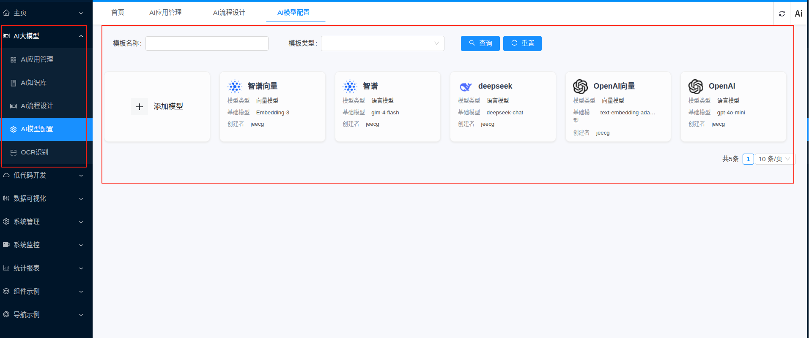
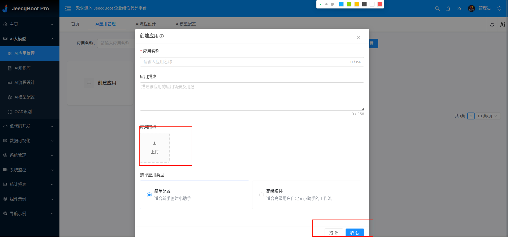
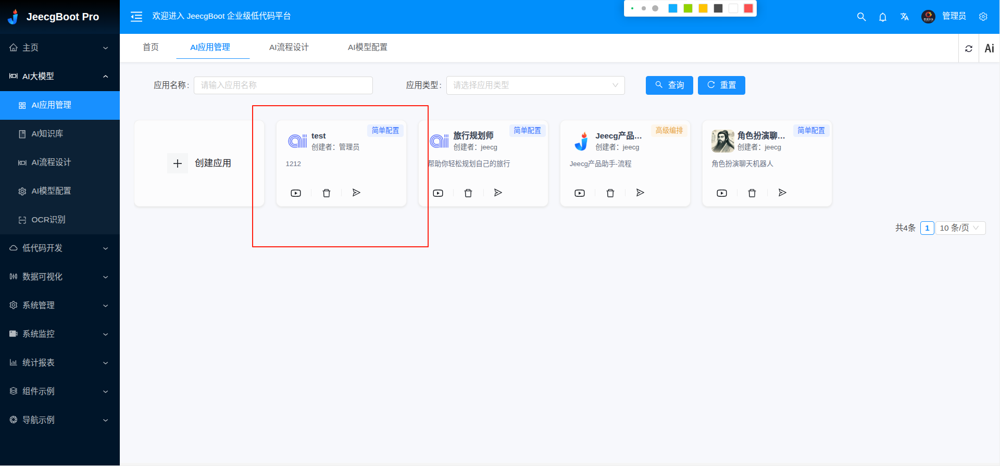

# 制作一个ai 流程配置工具,具体功能有以下功能

-- AI应用管理

-- AI知识库

-- AI流程设计

-- AI模型配置

-- OCR识别


##  1.布局如下


## 2. AI应用管理

### 2.1 AI应用管理-创建应用

- 单击创建应用弹出创建应用表单, 表单内容 应用名称, 应用描述,上传应用图标, 选择应用类型 (简单应用, 高级编排应用)
 如下图


当输入万应用信息后， 单击确定， 弹出应用编辑界面。

- 应用编辑 [应用编辑](./project_imgs/3.edid_app.png): 
  1. 可以手动编辑应用的提示词。
  2. 可手动编辑应用的开场白
  3. 可手动 选择应用的模型[选择模型](./project_imgs/4.select_model.png)
  5. 单击保存可以保存应用信息 选择应用的模型[保存](./project_imgs/5.save_app.png)
  6. 关闭编辑框， 在应用列表可以查询新增应用信息

- 可以根据 应用名称， 进行查询

### 2.1 AI应用管理-查询

- 可以根据 应用类型进行查询， 应用类型有简单配置和高级编排两种类型

- 可以根据 应用名称， 进行查询


### 3. 技术架构

请基于 
```
element-ui
vue3 
```

实现


